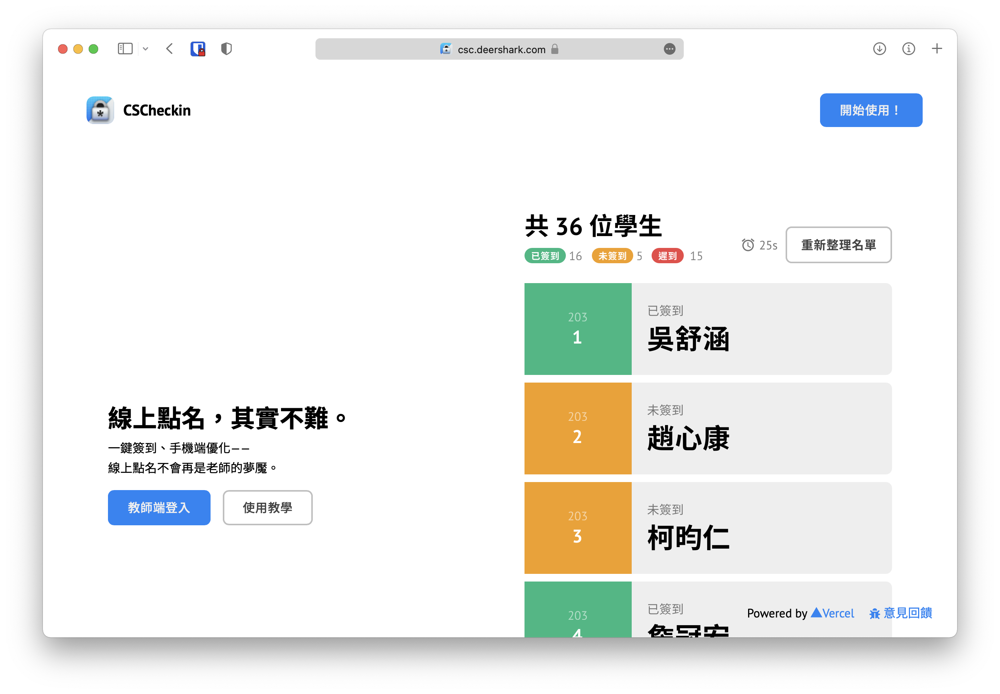
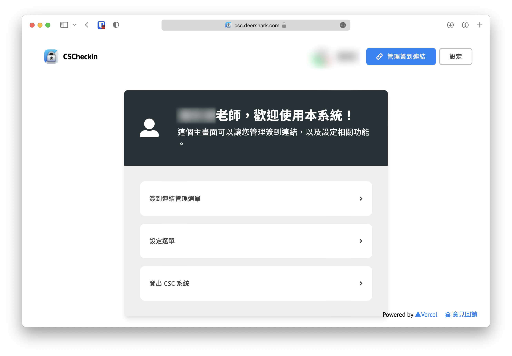
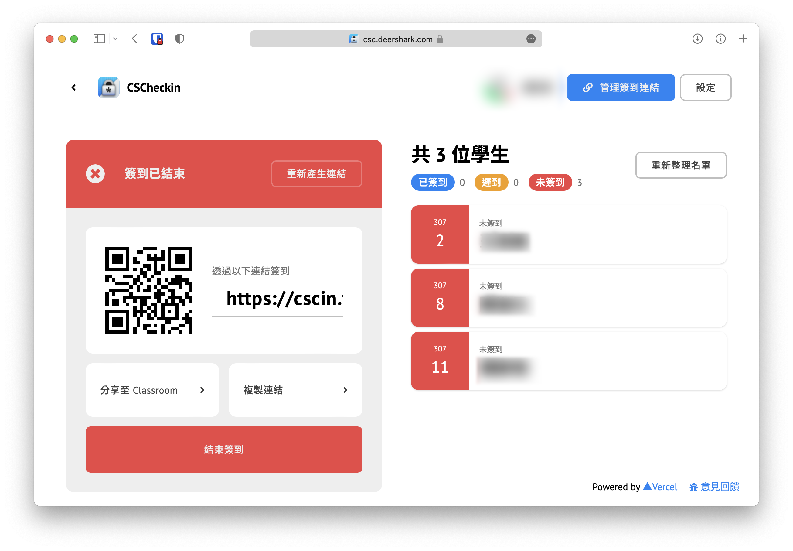

<div align="center">
  <h1>CSCheckin (Frontend)</h1>
  <div class="introduction">
    <p>
      <b>網課專用，一鍵簽到，基於 Google Classroom 的簽到平台。</b>
      <a href="https://dstw.dev">立即使用 →</a>
    </p>
  </div>
  <div>
    
    
    
  </div>
</div>

---

## Codebase features

- Automatically analyze code after pushing to GitHub
  - Analyze with `CodeQL`
  - Analyze with `njsscan`
  - Check if linted with `yarn lint`
  - Test building production build with `yarn build`
  - Test building Docker with `docker build`
- Available to build as a Docker image
  - Exclude all useless components for a production build
    - For example, `storybook` and `eslint`
- Built-in `.vercelignore` so that you can install dependencies with `yarn --production`
  - Exclude all useless components for a production build
    - For example, `storybook` and `eslint`
- Built-in Sentry support
- Built-in Google Analytics support
- Built-in NProgress (process bar) support
- Built-in ESLint support
  - with featured ESLint rules
  - strictly follow the `ESLint` rules
- [Component Driven User Interfaces](https://www.componentdriven.org)
  - Built-in Storybook support

<!-- TODO: MOPCOP '21 Records -->

## Configure

Copy `.env.local.example` to `.env.local`, and edit the corresponding value.

## Test

```bash
yarn dev   # the Watch Mode of Next.js
yarn lint  # check if the codebase has any issue
```

## Build

```bash
yarn build  # Build this codebase
yarn start  # Serve the built artifact
```

## Deploy

You can deploy CSCheckin to any platform. However,
We recommended deploying on Vercel:

[](https://vercel.com/new/clone?repository-url=https%3A%2F%2Fgithub.com%2Fsmhs-os-project%2Fcscheckin-fe&env=NEXT_PUBLIC_GA_ID&project-name=csc-unofficial-vercel-fe&repo-name=csc-unofficial-vercel-fe&utm_source=smhs-os-project&utm_campaign=oss)

## License

MIT License.
